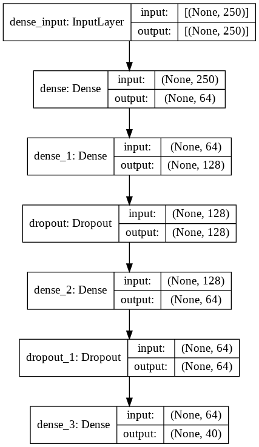

# Software Lab 4 Mini Project
## Student Specific Chat Bot

## OBJECTIVE

We aim to make an application that will cater towards students of colleges, as a helper portal that assists students in day to day activities.With the vision of making online sem feel more like real college attending, We also plan to create a bot that can assist in this application, and can act as a friendly assistant that automates and makes this app more user intuitive. Incluing the use technologies like NLP's in dialogflow and ML in tensorflow to build the app and the bot is a future plan We will also use Cloud services to integrate the bot and the app more closely.

### Members :

1. KAUSTUBH WANKHEDE - BT18CSE006
2. UJJWAL SHARMA - BT18CSE021 ( TEAM LEADER )
3. KAUSTUBH KATHARE - BT18CSE024
4. ABIN JOSEPH - BT18CSE025
5. ADITYA DHANE - BT18CSE028
6. ADESH OSWAL - BT18CSE151

## CONTRIBUTIONS

## App Development :
    . KAUSTUBH WANKHEDE
    . Abin Joseph

## Data Gathering :
    . UJJWAL SHARMA
    . KAUSTUBH KATHARE
    . ABIN JOSEPH
    . KAUSTUBH WANKHEDE
    . ADITYA DHANE
    . ADESH OSWAL

## Statement Processing :
    . UJJWAL SHARMA
    . Aditya Dhane
    . Adesh Oswal

## Deep Learning ( Model Architecture and Training) :
    . Ujjwal Sharma

## Server And Deployment :
    . UJJWAL SHARMA
    . Kaustubh Kathare

The project is deployed on heroku

### Usage
  Very simple to use . Just install the app and start chatting! ;)

# Neural Net architecture :

